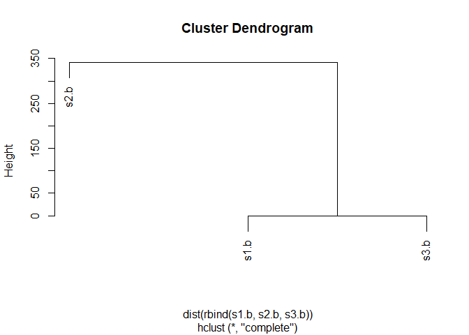

Class 6 R Function
================
Adarsh
10/17/2019

# This is H1

This is my lab 6 work from **BIMM 143**

``` r
add <- function(x, y=1){
    x+y
}
```

``` r
add(1)
```

    ## [1] 2

``` r
add(5,5)
```

    ## [1] 10

``` r
add(x = 1, y=4)
```

    ## [1] 5

``` r
add(c(1,2,3),c(2,3,4))
```

    ## [1] 3 5 7

``` r
rescale <- function(x) {
 rng <-range(x,na.rm =TRUE)
 (x - rng[1]) / (rng[2] - rng[1])
}
# Test on a small example where you know the answer
rescale(c(1,2,NA,3,10))
```

    ## [1] 0.0000000 0.1111111        NA 0.2222222 1.0000000

``` r
rescale2 <- function(x, na.rm=TRUE, plot=FALSE) {
 rng <-range(x, na.rm=na.rm)
 print("Hello")
 answer <- (x - rng[1]) / (rng[2] - rng[1])
 print("is it me you are looking for?")
 if(plot) {
 plot(answer, typ="b", lwd=4)
 }
 print("I can see it in ...")
 return(answer)
}
```

``` r
rescale2(c(1:10),plot = TRUE)
```

    ## [1] "Hello"
    ## [1] "is it me you are looking for?"

<!-- -->

    ## [1] "I can see it in ..."

    ##  [1] 0.0000000 0.1111111 0.2222222 0.3333333 0.4444444 0.5555556 0.6666667
    ##  [8] 0.7777778 0.8888889 1.0000000

# Section2 of hands-on sheet

Installing the **bio3d** package

``` r
#install.packages(“bio3d”)
```

``` r
library(bio3d)
s1 <- read.pdb("4AKE") # kinase with drug
```

    ##   Note: Accessing on-line PDB file

``` r
s2 <- read.pdb("1AKE") # kinase no drug
```

    ##   Note: Accessing on-line PDB file
    ##    PDB has ALT records, taking A only, rm.alt=TRUE

``` r
s3 <- read.pdb("1E4Y") # kinase with drug
```

    ##   Note: Accessing on-line PDB file

``` r
s1.chainA <- trim.pdb(s1, chain="A", elety="CA")
s2.chainA <- trim.pdb(s2, chain="A", elety="CA")
s3.chainA <- trim.pdb(s1, chain="A", elety="CA")

s1.b <- s1.chainA$atom$b
s2.b <- s2.chainA$atom$b
s3.b <- s3.chainA$atom$b

plotb3(s1.b, sse=s1.chainA, typ="l", ylab="Bfactor")
```

<!-- -->

``` r
plotb3(s2.b, sse=s2.chainA, typ="l", ylab="Bfactor")
```

<!-- -->

``` r
plotb3(s3.b, sse=s3.chainA, typ="l", ylab="Bfactor")
```

<!-- -->

``` r
hc <- hclust( dist( rbind(s1.b, s2.b, s3.b) ) )
plot(hc)
```

<!-- -->
