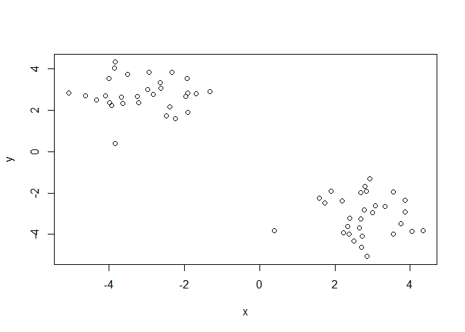
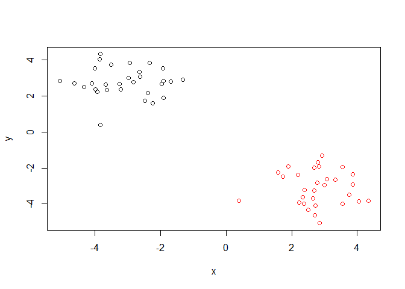
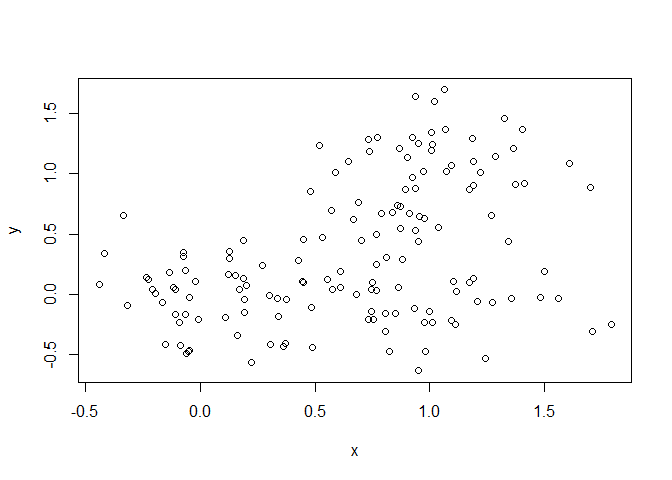
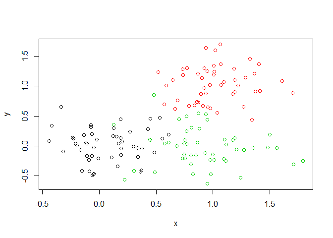

Class08\_ML
================
Adarsh
10/24/2019

``` r
# Generate some example data for clustering
tmp <- c(rnorm(30,-3), rnorm(30,3))
x <- cbind(x=tmp, y=rev(tmp))
plot(x)
```

<!-- -->

``` r
k <- kmeans(x,centers = 2,nstart =20)
```

``` r
k
```

    ## K-means clustering with 2 clusters of sizes 30, 30
    ## 
    ## Cluster means:
    ##           x         y
    ## 1  2.880545 -3.264177
    ## 2 -3.264177  2.880545
    ## 
    ## Clustering vector:
    ##  [1] 2 2 2 2 2 2 2 2 2 2 2 2 2 2 2 2 2 2 2 2 2 2 2 2 2 2 2 2 2 2 1 1 1 1 1
    ## [36] 1 1 1 1 1 1 1 1 1 1 1 1 1 1 1 1 1 1 1 1 1 1 1 1 1
    ## 
    ## Within cluster sum of squares by cluster:
    ## [1] 58.21735 58.21735
    ##  (between_SS / total_SS =  90.7 %)
    ## 
    ## Available components:
    ## 
    ## [1] "cluster"      "centers"      "totss"        "withinss"    
    ## [5] "tot.withinss" "betweenss"    "size"         "iter"        
    ## [9] "ifault"

``` r
k$cluster
```

    ##  [1] 2 2 2 2 2 2 2 2 2 2 2 2 2 2 2 2 2 2 2 2 2 2 2 2 2 2 2 2 2 2 1 1 1 1 1
    ## [36] 1 1 1 1 1 1 1 1 1 1 1 1 1 1 1 1 1 1 1 1 1 1 1 1 1

``` r
plot(x,col = k$cluster)
points(k$centers,col = "blue",pch =15)
```

<!-- -->

## Heirarchial Clustering in R

The ‘hclust()’ function needs distance matrix from ‘dist()’ function as
input for Euclidean distance

``` r
# First we need to calculate point (dis)similarity
# as the Euclidean distance between observations
dist_matrix <- dist(x)
# The hclust() function returns a hierarchical
# clustering model
hc <- hclust(dist_matrix)
# the print method is not so useful here
hc
```

    ## 
    ## Call:
    ## hclust(d = dist_matrix)
    ## 
    ## Cluster method   : complete 
    ## Distance         : euclidean 
    ## Number of objects: 60

``` r
plot(hc)
abline(h=6, col = "red")
```

<!-- -->

``` r
groups <-cutree(hc, h = 6)
```

``` r
plot(x,col = groups)
```

<!-- -->

``` r
# Step 1. Generate some example data for clustering
x <- rbind(
 matrix(rnorm(100, mean=0, sd = 0.3), ncol = 2), # c1
 matrix(rnorm(100, mean = 1, sd = 0.3), ncol = 2), # c2
 matrix(c(rnorm(50, mean = 1, sd = 0.3), # c3
 rnorm(50, mean = 0, sd = 0.3)), ncol = 2))
colnames(x) <- c("x", "y")
# Step 2. Plot the data without clustering
plot(x)
```

<!-- -->

``` r
# Step 3. Generate colors for known clusters
# (just so we can compare to hclust results)
col <- as.factor( rep(c("c1","c2","c3"), each=50) )
plot(x, col=col)
```

<!-- -->

``` r
hc <- hclust(dist(x))
hc
```

    ## 
    ## Call:
    ## hclust(d = dist(x))
    ## 
    ## Cluster method   : complete 
    ## Distance         : euclidean 
    ## Number of objects: 150

``` r
plot(hc)
abline(h=2, col = "red")
```

<!-- -->

``` r
groups <-cutree(hc, k = 3)
```

``` r
plot(x, col = groups)
```

<!-- -->

``` r
k <- kmeans(x,centers = 3,nstart =20)
plot(x,col = k$cluster)
points(k$centers,col = "blue",pch =15)
```

<!-- -->

Ponts in Each Cluster

``` r
table(groups)
```

    ## groups
    ##  1  2  3 
    ## 70 33 47

Cross-Tabulate with known results

``` r
table(groups,col)
```

    ##       col
    ## groups c1 c2 c3
    ##      1 17  5 48
    ##      2 33  0  0
    ##      3  0 45  2
