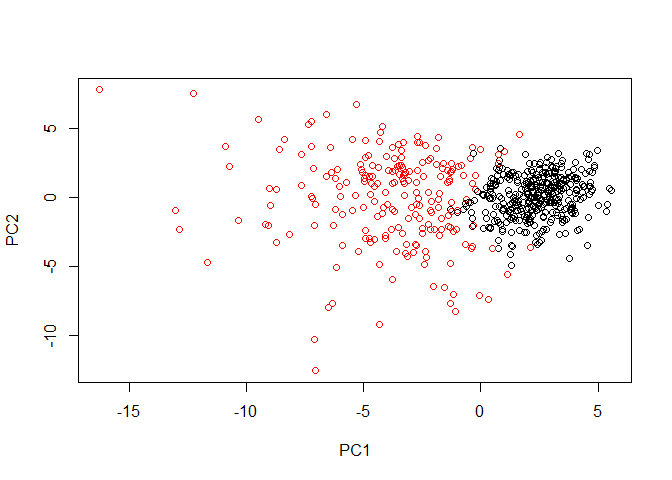
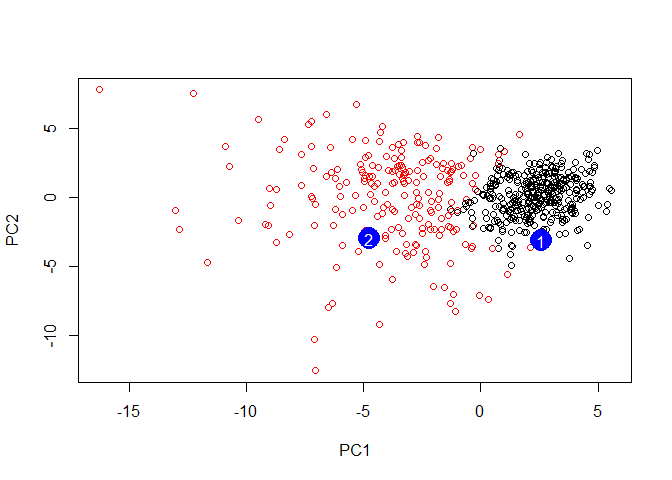

Miniproject
================
Adarsh
10/29/2019

``` r
# Save your input data file to a new 'data' directory
fna.data <- "WisconsinCancer.csv"

# Complete the following code to input the data and store as wisc.df
wisc.df <- read.csv(fna.data)
```

``` r
head(wisc.df)
```

    ##         id diagnosis radius_mean texture_mean perimeter_mean area_mean
    ## 1   842302         M       17.99        10.38         122.80    1001.0
    ## 2   842517         M       20.57        17.77         132.90    1326.0
    ## 3 84300903         M       19.69        21.25         130.00    1203.0
    ## 4 84348301         M       11.42        20.38          77.58     386.1
    ## 5 84358402         M       20.29        14.34         135.10    1297.0
    ## 6   843786         M       12.45        15.70          82.57     477.1
    ##   smoothness_mean compactness_mean concavity_mean concave.points_mean
    ## 1         0.11840          0.27760         0.3001             0.14710
    ## 2         0.08474          0.07864         0.0869             0.07017
    ## 3         0.10960          0.15990         0.1974             0.12790
    ## 4         0.14250          0.28390         0.2414             0.10520
    ## 5         0.10030          0.13280         0.1980             0.10430
    ## 6         0.12780          0.17000         0.1578             0.08089
    ##   symmetry_mean fractal_dimension_mean radius_se texture_se perimeter_se
    ## 1        0.2419                0.07871    1.0950     0.9053        8.589
    ## 2        0.1812                0.05667    0.5435     0.7339        3.398
    ## 3        0.2069                0.05999    0.7456     0.7869        4.585
    ## 4        0.2597                0.09744    0.4956     1.1560        3.445
    ## 5        0.1809                0.05883    0.7572     0.7813        5.438
    ## 6        0.2087                0.07613    0.3345     0.8902        2.217
    ##   area_se smoothness_se compactness_se concavity_se concave.points_se
    ## 1  153.40      0.006399        0.04904      0.05373           0.01587
    ## 2   74.08      0.005225        0.01308      0.01860           0.01340
    ## 3   94.03      0.006150        0.04006      0.03832           0.02058
    ## 4   27.23      0.009110        0.07458      0.05661           0.01867
    ## 5   94.44      0.011490        0.02461      0.05688           0.01885
    ## 6   27.19      0.007510        0.03345      0.03672           0.01137
    ##   symmetry_se fractal_dimension_se radius_worst texture_worst
    ## 1     0.03003             0.006193        25.38         17.33
    ## 2     0.01389             0.003532        24.99         23.41
    ## 3     0.02250             0.004571        23.57         25.53
    ## 4     0.05963             0.009208        14.91         26.50
    ## 5     0.01756             0.005115        22.54         16.67
    ## 6     0.02165             0.005082        15.47         23.75
    ##   perimeter_worst area_worst smoothness_worst compactness_worst
    ## 1          184.60     2019.0           0.1622            0.6656
    ## 2          158.80     1956.0           0.1238            0.1866
    ## 3          152.50     1709.0           0.1444            0.4245
    ## 4           98.87      567.7           0.2098            0.8663
    ## 5          152.20     1575.0           0.1374            0.2050
    ## 6          103.40      741.6           0.1791            0.5249
    ##   concavity_worst concave.points_worst symmetry_worst
    ## 1          0.7119               0.2654         0.4601
    ## 2          0.2416               0.1860         0.2750
    ## 3          0.4504               0.2430         0.3613
    ## 4          0.6869               0.2575         0.6638
    ## 5          0.4000               0.1625         0.2364
    ## 6          0.5355               0.1741         0.3985
    ##   fractal_dimension_worst  X
    ## 1                 0.11890 NA
    ## 2                 0.08902 NA
    ## 3                 0.08758 NA
    ## 4                 0.17300 NA
    ## 5                 0.07678 NA
    ## 6                 0.12440 NA

``` r
# Convert the features of the data: wisc.data
wisc.data <- as.matrix(wisc.df[3:32])
```

``` r
row.names(wisc.data) <- wisc.df$id
```

``` r
nrow(wisc.data)
```

    ## [1] 569

We have ‘r nrow(wisc.df)’ samples in the
    dataset

``` r
diagnosis <- wisc.df$diagnosis
```

``` r
diagnosis
```

    ##   [1] M M M M M M M M M M M M M M M M M M M B B B M M M M M M M M M M M M M
    ##  [36] M M B M M M M M M M M B M B B B B B M M B M M B B B B M B M M B B B B
    ##  [71] M B M M B M B M M B B B M M B M M M B B B M B B M M B B B M M B B B B
    ## [106] M B B M B B B B B B B B M M M B M M B B B M M B M B M M B M M B B M B
    ## [141] B M B B B B M B B B B B B B B B M B B B B M M B M B B M M B B M M B B
    ## [176] B B M B B M M M B M B M B B B M B B M M B M M M M B M M M B M B M B B
    ## [211] M B M M M M B B M M B B B M B B B B B M M B B M B B M M B M B B B B M
    ## [246] B B B B B M B M M M M M M M M M M M M M M B B B B B B M B M B B M B B
    ## [281] M B M M B B B B B B B B B B B B B M B B M B M B B B B B B B B B B B B
    ## [316] B B M B B B M B M B B B B M M M B B B B M B M B M B B B M B B B B B B
    ## [351] B M M M B B B B B B B B B B B M M B M M M B M M B B B B B M B B B B B
    ## [386] M B B B M B B M M B B B B B B M B B B B B B B M B B B B B M B B M B B
    ## [421] B B B B B B B B B B M B M M B M B B B B B M B B M B M B B M B M B B B
    ## [456] B B B B B M M B B B B B B M B B B B B B B B B B M B B B B B B B M B M
    ## [491] B B M B B B B B M M B M B M B B B B B M B B M B M B M M B B B M B B B
    ## [526] B B B B B B B B M B M M B B B B B B B B B B B B B B B B B B B B B B B
    ## [561] B B M M M M M M B
    ## Levels: B M

``` r
table(diagnosis)
```

    ## diagnosis
    ##   B   M 
    ## 357 212

``` r
length(grep('_mean',colnames(wisc.df),value = TRUE))
```

    ## [1] 10

## PCA

``` r
# Check column means and standard deviations
round(colMeans(wisc.data),3)
```

    ##             radius_mean            texture_mean          perimeter_mean 
    ##                  14.127                  19.290                  91.969 
    ##               area_mean         smoothness_mean        compactness_mean 
    ##                 654.889                   0.096                   0.104 
    ##          concavity_mean     concave.points_mean           symmetry_mean 
    ##                   0.089                   0.049                   0.181 
    ##  fractal_dimension_mean               radius_se              texture_se 
    ##                   0.063                   0.405                   1.217 
    ##            perimeter_se                 area_se           smoothness_se 
    ##                   2.866                  40.337                   0.007 
    ##          compactness_se            concavity_se       concave.points_se 
    ##                   0.025                   0.032                   0.012 
    ##             symmetry_se    fractal_dimension_se            radius_worst 
    ##                   0.021                   0.004                  16.269 
    ##           texture_worst         perimeter_worst              area_worst 
    ##                  25.677                 107.261                 880.583 
    ##        smoothness_worst       compactness_worst         concavity_worst 
    ##                   0.132                   0.254                   0.272 
    ##    concave.points_worst          symmetry_worst fractal_dimension_worst 
    ##                   0.115                   0.290                   0.084

``` r
round(apply(wisc.data,2,sd),3)
```

    ##             radius_mean            texture_mean          perimeter_mean 
    ##                   3.524                   4.301                  24.299 
    ##               area_mean         smoothness_mean        compactness_mean 
    ##                 351.914                   0.014                   0.053 
    ##          concavity_mean     concave.points_mean           symmetry_mean 
    ##                   0.080                   0.039                   0.027 
    ##  fractal_dimension_mean               radius_se              texture_se 
    ##                   0.007                   0.277                   0.552 
    ##            perimeter_se                 area_se           smoothness_se 
    ##                   2.022                  45.491                   0.003 
    ##          compactness_se            concavity_se       concave.points_se 
    ##                   0.018                   0.030                   0.006 
    ##             symmetry_se    fractal_dimension_se            radius_worst 
    ##                   0.008                   0.003                   4.833 
    ##           texture_worst         perimeter_worst              area_worst 
    ##                   6.146                  33.603                 569.357 
    ##        smoothness_worst       compactness_worst         concavity_worst 
    ##                   0.023                   0.157                   0.209 
    ##    concave.points_worst          symmetry_worst fractal_dimension_worst 
    ##                   0.066                   0.062                   0.018

``` r
wisc.pr <- prcomp(wisc.data,scale = TRUE)
summary(wisc.pr)
```

    ## Importance of components:
    ##                           PC1    PC2     PC3     PC4     PC5     PC6
    ## Standard deviation     3.6444 2.3857 1.67867 1.40735 1.28403 1.09880
    ## Proportion of Variance 0.4427 0.1897 0.09393 0.06602 0.05496 0.04025
    ## Cumulative Proportion  0.4427 0.6324 0.72636 0.79239 0.84734 0.88759
    ##                            PC7     PC8    PC9    PC10   PC11    PC12
    ## Standard deviation     0.82172 0.69037 0.6457 0.59219 0.5421 0.51104
    ## Proportion of Variance 0.02251 0.01589 0.0139 0.01169 0.0098 0.00871
    ## Cumulative Proportion  0.91010 0.92598 0.9399 0.95157 0.9614 0.97007
    ##                           PC13    PC14    PC15    PC16    PC17    PC18
    ## Standard deviation     0.49128 0.39624 0.30681 0.28260 0.24372 0.22939
    ## Proportion of Variance 0.00805 0.00523 0.00314 0.00266 0.00198 0.00175
    ## Cumulative Proportion  0.97812 0.98335 0.98649 0.98915 0.99113 0.99288
    ##                           PC19    PC20   PC21    PC22    PC23   PC24
    ## Standard deviation     0.22244 0.17652 0.1731 0.16565 0.15602 0.1344
    ## Proportion of Variance 0.00165 0.00104 0.0010 0.00091 0.00081 0.0006
    ## Cumulative Proportion  0.99453 0.99557 0.9966 0.99749 0.99830 0.9989
    ##                           PC25    PC26    PC27    PC28    PC29    PC30
    ## Standard deviation     0.12442 0.09043 0.08307 0.03987 0.02736 0.01153
    ## Proportion of Variance 0.00052 0.00027 0.00023 0.00005 0.00002 0.00000
    ## Cumulative Proportion  0.99942 0.99969 0.99992 0.99997 1.00000 1.00000

``` r
biplot(wisc.pr,scale = TRUE)
```

<!-- -->

``` r
plot(wisc.pr$x[,1], wisc.pr$x[,2],col = diagnosis,xlab = "PC1", ylab = "PC2")
```

<!-- -->

``` r
plot(wisc.pr$x[,1], wisc.pr$x[,3],col = diagnosis,xlab = "PC1", ylab = "PC3")
```

<!-- -->

``` r
plot(wisc.pr)
```

<!-- -->

``` r
## ggplot based graph
#install.packages("factoextra")
library(factoextra)
```

    ## Loading required package: ggplot2

    ## Welcome! Related Books: `Practical Guide To Cluster Analysis in R` at https://goo.gl/13EFCZ

``` r
fviz_eig(wisc.pr, addlabels = TRUE)
```

<!-- -->

## Heirarchial Clustering

``` r
data.scaled <- scale(wisc.data)
```

``` r
data.dist <- dist(data.scaled)
```

``` r
wisc.hclust <- hclust(data.dist, method = "complete")
```

``` r
plot(wisc.hclust)
abline(h=19, col="red",lty=2)
```

<!-- -->

``` r
wisc.hclust.clusters <- cutree(wisc.hclust, k=4)
```

``` r
table(wisc.hclust.clusters, diagnosis)
```

    ##                     diagnosis
    ## wisc.hclust.clusters   B   M
    ##                    1  12 165
    ##                    2   2   5
    ##                    3 343  40
    ##                    4   0   2

``` r
wisc.hclust.clusters <- cutree(wisc.hclust, k=5)
table(wisc.hclust.clusters, diagnosis)
```

    ##                     diagnosis
    ## wisc.hclust.clusters   B   M
    ##                    1  12 165
    ##                    2   0   5
    ##                    3 343  40
    ##                    4   2   0
    ##                    5   0   2

``` r
new_data <-wisc.pr$x[,1:7]
```

``` r
data.dist <- dist(new_data)
```

``` r
wisc.pr.hclust <- hclust(data.dist, method = "ward.D2")
plot(wisc.hclust)
```

<!-- -->

``` r
grps <- cutree(wisc.pr.hclust, k=2)
table(grps)
```

    ## grps
    ##   1   2 
    ## 216 353

``` r
table(grps, diagnosis)
```

    ##     diagnosis
    ## grps   B   M
    ##    1  28 188
    ##    2 329  24

``` r
plot(wisc.pr$x[,1:2], col=grps)
```

<!-- -->

``` r
plot(wisc.pr$x[,1:2], col=grps)
```

<!-- -->

``` r
g <- as.factor(grps)
levels(g)
```

    ## [1] "1" "2"

``` r
g <- relevel(g,2)
levels(g)
```

    ## [1] "2" "1"

``` r
plot(wisc.pr$x[,1:2], col=g)
```

<!-- -->

## Prediction

``` r
url <- "https://tinyurl.com/new-samples-CSV"
new <- read.csv(url)
npc <- predict(wisc.pr, newdata=new)
npc
```

    ##            PC1       PC2        PC3        PC4       PC5        PC6
    ## [1,]  2.576616 -3.135913  1.3990492 -0.7631950  2.781648 -0.8150185
    ## [2,] -4.754928 -3.009033 -0.1660946 -0.6052952 -1.140698 -1.2189945
    ##             PC7        PC8       PC9       PC10      PC11      PC12
    ## [1,] -0.3959098 -0.2307350 0.1029569 -0.9272861 0.3411457  0.375921
    ## [2,]  0.8193031 -0.3307423 0.5281896 -0.4855301 0.7173233 -1.185917
    ##           PC13     PC14      PC15       PC16        PC17        PC18
    ## [1,] 0.1610764 1.187882 0.3216974 -0.1743616 -0.07875393 -0.11207028
    ## [2,] 0.5893856 0.303029 0.1299153  0.1448061 -0.40509706  0.06565549
    ##             PC19       PC20       PC21       PC22       PC23       PC24
    ## [1,] -0.08802955 -0.2495216  0.1228233 0.09358453 0.08347651  0.1223396
    ## [2,]  0.25591230 -0.4289500 -0.1224776 0.01732146 0.06316631 -0.2338618
    ##             PC25         PC26         PC27        PC28         PC29
    ## [1,]  0.02124121  0.078884581  0.220199544 -0.02946023 -0.015620933
    ## [2,] -0.20755948 -0.009833238 -0.001134152  0.09638361  0.002795349
    ##              PC30
    ## [1,]  0.005269029
    ## [2,] -0.019015820

``` r
plot(wisc.pr$x[,1:2], col=g)
points(npc[,1], npc[,2], col="blue", pch=16, cex=3)
text(npc[,1], npc[,2], c(1,2), col="white")
```

<!-- -->
