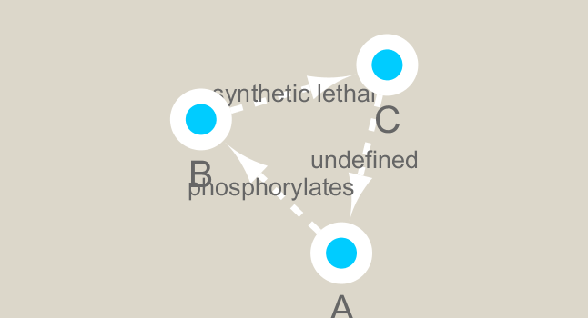
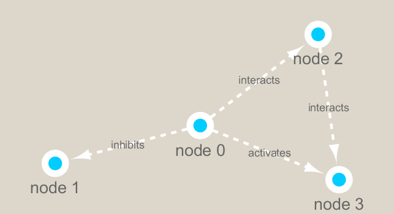

```{r setup, include=FALSE}
knitr::opts_chunk$set(echo = TRUE)
```

## Biological Network Analysis

First we need to install some necessary packages:

```{r}
# CRAN packages
# install.packages( c("igraph", "RColorBrewer"))

# Bioconductor package
# source("https://bioconductor.org/biocLite.R")
# biocLite("RCy3")

library(RCy3)
library(igraph)
library(RColorBrewer)
```

The RCy3 package connects us to Cytoscape. Lets check to make sure our connection is working.

(Need to have Cytoscape open for this to work):

```{r}
# library(RCy3)
cytoscapePing()

```


```{r}
# Check the version
cytoscapeVersionInfo()
```


```{r}
g <- makeSimpleIgraph()
createNetworkFromIgraph(g,"myGraph")
```
```{r}
#fig <- exportImage(filename="demo", type="png", height=350)

```


```{r}

```


```{r}
setVisualStyle("Marquee")

```


```{r}
#fig <- exportImage(filename="demo_marquee", type="png", height=350)
```

```{r}

```


```{r}
library(knitr)

```

```{r}
styles <- getVisualStyleNames()
styles
```

```{r}
plot(g)
```


## Reading Metagenomics Data

Lets read in a species co-occurence matrix (from Lima-Mendez et al. (2015))

```{r}
# read in the data
prok_vir_co <- read.delim("./data/virus_prok_cor_abundant.tsv", stringsAsFactors = FALSE)

# check our data
head(prok_vir_co)
```


```{r}
g <- graph.data.frame(prok_vir_co, directed = FALSE)

# the class of this object should be "igraph"
class(g)
```


```{r}
plot(g)
```


```{r}
plot(g, vertex.size = 3, vertex.label = NA)
```

NOTE: We can query and set vertex and edges using **V()** and **E()**:

```{r}
V(g)

E(g)
```

We also have a **vertex.attributes()** and **edge.attributes()** function that query all vertex and edge elements in an *igraph* object.

## Read in Taxonomic Classification

Because our data was collected in a shotgun-sequencing style, we need to be able to differentiate between samples. We can do this by using known samples (in our case, bacteriophage sequences) and comparing our collected samples to known samples from BLAST. These known samples are contained within the two files that we will read in next:

```{r}
phage_id_affiliation <- read.delim("./data/phage_ids_with_affiliation.tsv")
head(phage_id_affiliation)

bac_id_affi <- read.delim("./data/prok_tax_from_silva.tsv")
head(bac_id_affi)
```


```{r}
V(g)
E(g)

```

# Network Community Detection

```{r}
cb <- cluster_edge_betweenness(g)
cb

```


```{r}
plot(cb, y=g, vertex.label=NA,  vertex.size=3)

```


```{r}
head( membership(cb) )

```

```{r}
# Calculate and plot node degree of our network
d <- degree(g)
hist(d, breaks=30, col="lightblue", main ="Node Degree Distribution")

```


```{r}
plot( degree_distribution(g), type="h" )

```

```{r}
pr <- page_rank(g)
head(pr$vector)
```

```{r}
v.size <- BBmisc::normalize(pr$vector, range=c(2,20), method="range")
plot(g, vertex.size=v.size, vertex.label=NA)
```


```{r}
v.size <- BBmisc::normalize(d, range=c(2,20), method="range")
plot(g, vertex.size=v.size, vertex.label=NA)
```


```{r}
b <- betweenness(g)
v.size <- BBmisc::normalize(b, range=c(2,20), method="range")
plot(g, vertex.size=v.size, vertex.label=NA)
```

# Taxonomic annotation
```{r}
phage_id_affiliation <- read.delim("./data/phage_ids_with_affiliation.tsv")
head(phage_id_affiliation)
```


```{r}
bac_id_affi <- read.delim("./data/prok_tax_from_silva.tsv", stringsAsFactors = FALSE)
head(bac_id_affi)
```


```{r}
## Extract out our vertex names
genenet.nodes <- as.data.frame(vertex.attributes(g), stringsAsFactors=FALSE)
head(genenet.nodes)
```


```{r}
length( grep("^ph_",genenet.nodes[,1]) )


```

```{r}
z <- bac_id_affi[,c("Accession_ID", "Kingdom", "Phylum", "Class")]
n <- merge(genenet.nodes, z, by.x="name", by.y="Accession_ID", all.x=TRUE)
head(n)

```

```{r}
colnames(n)

```

```{r}
colnames(phage_id_affiliation)

```

```{r}
# Again we only need a subset of `phage_id_affiliation` for our purposes
y <- phage_id_affiliation[, c("first_sheet.Phage_id_network", "phage_affiliation","Tax_order", "Tax_subfamily")]

# Add the little phage annotation that we have
x <- merge(x=n, y=y, by.x="name", by.y="first_sheet.Phage_id_network", all.x=TRUE)

## Remove duplicates from multiple matches
x <- x[!duplicated( (x$name) ),]
head(x)
```

```{r}
genenet.nodes <- x

```

# Send Network to Cytoscape using RCy3


```{r}
# Open a new connection and delete any existing windows/networks in Cy
deleteAllNetworks()
```

```{r}
# Set the main nodes colname to the required "id" 
colnames(genenet.nodes)[1] <- "id"
```

```{r}
genenet.edges <- data.frame(igraph::as_edgelist(g))

# Set the main edges colname to the required "source" and "target" 
colnames(genenet.edges) <- c("source","target")

# Add the weight from igraph to a new column...
genenet.edges$Weight <- igraph::edge_attr(g)$weight

# Send as a new network to Cytoscape
createNetworkFromDataFrames(genenet.nodes,genenet.edges, 
                            title="Tara_Oceans")
```

